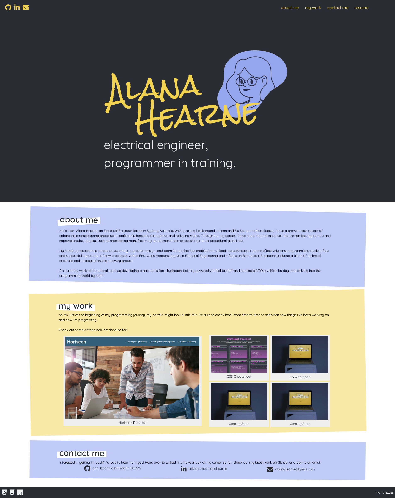

# ahearne-portfolio
02-Advanced-CSS/02-Challenge - using advanced CSS to build a responsive HTML/CSS Portfolio with media queries

## Description

Module 2 - Advanced CSS Challenge: Personal Portfolio

Development of HTML and CSS code to create a portfolio website, through the execution of the following:
- clickable thumbnails showcasing developed applications
- ensuring all links are functional
- consolidation of CSS selectors and properties
- inclusion of HTML selectors (headers, footers, nav, sections, meta)
- using advanced CSS techniques (media queries, flexbox) to ensure responsiveness across different screen sizes
- addition of comments to improve readability

Project executed in accordance with the following challenge requirements:

### User Story

```md
AS AN employer
I WANT to view a potential employee's deployed portfolio of work samples
SO THAT I can review samples of their work and assess whether they're a good candidate for an open position
```

## Acceptance Criteria

Here are the critical requirements necessary to develop a portfolio that satisfies a typical hiring manager’s needs:

```md
GIVEN I need to sample a potential employee's previous work
WHEN I load their portfolio
THEN I am presented with the developer's name, a recent photo or avatar, and links to sections about them, their work, and how to contact them
WHEN I click one of the links in the navigation
THEN the UI scrolls to the corresponding section
WHEN I click on the link to the section about their work
THEN the UI scrolls to a section with titled images of the developer's applications
WHEN I am presented with the developer's first application
THEN that application's image should be larger in size than the others
WHEN I click on the images of the applications
THEN I am taken to that deployed application
WHEN I resize the page or view the site on various screens and devices
THEN I am presented with a responsive layout that adapts to my viewport
```

## Table of Contents

- [Installation](#installation)
- [Usage](#usage)
- [Credits](#credits)
- [License](#license)

## Installation

Git and an IDE (VSCode recommended) are required to be installed on your computer to clone and view the code for this web application.

From your command line:
```md
### Clone this repository
$ git clone git@github.com:ajhearne-mZAOSW/ahearne-portfolio.git

### Navigate into the repository
$ cd ahearne-portfolio

### Open in IDE
$ code .
```

## Usage

The following image shows the web application's appearance and functionality:



The web application is depoloyed using GitHub Pages: (https://ajhearne-mzaosw.github.io/ahearne-portfolio/)

## Credits

- Source starter code provided by University of Sydney, USYD-VIRT-FSF-PT-05-2024-U-LOLC/02-Advanced-CSS/02-Challenge/Develop
- Fonts from Google Fonts (https://fonts.google.com/)
- Icons from Font Awesome (https://fontawesome.com/icons)
- Avatar from Freepik

## License

MIT